# Week 1 - Data Exploration: Deep Summary

Source: `Week_1_-_Data_Exploration_ce24.pdf`  
Course: Data Analytics & Machine Learning  
Main topic: Exploratory Data Analysis (EDA)

This summary explains the Week 1 lecture in depth. The slide pictures are used as visual anchors: each important visual is followed by what it shows, what the parts do, and why that idea is needed in data analysis.

---

## 1. What this week is about

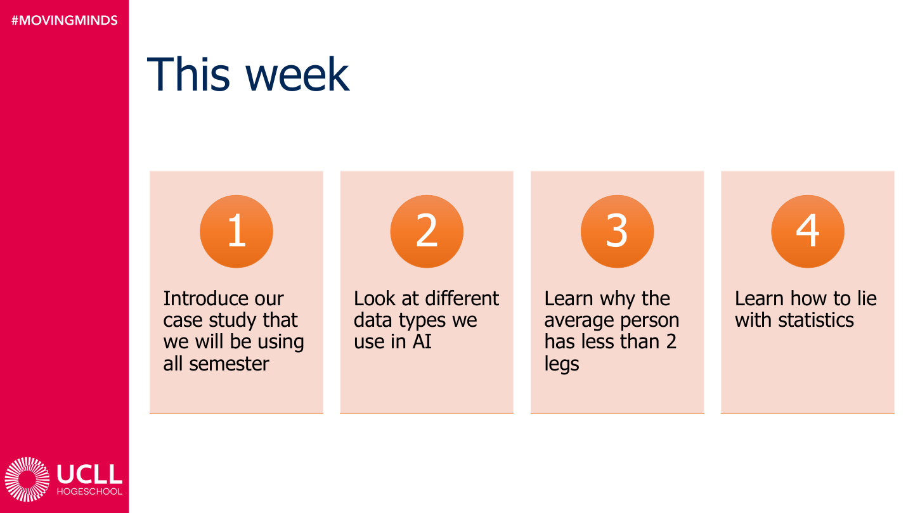

The lecture has four main goals:

1. Introduce the case study used during the semester.
2. Learn the different data types used in AI and analytics.
3. Understand why "the average person has less than 2 legs."
4. Learn how statistics can be used honestly or misleadingly.

### What each part does

- **The case study** gives the course a realistic business problem. Instead of learning formulas in isolation, the course connects data concepts to decisions a company might actually make.
- **Data types** tell us what kind of information each column contains. This matters because different data types need different calculations, charts, and machine-learning treatment.
- **The average legs example** shows that a mathematically correct statistic can still be easy to misunderstand.
- **"Lie with statistics"** introduces the idea that statistics are tools. A tool can clarify reality, but it can also hide important context if it is chosen or presented badly.

### Why this is needed

EDA is the step where we learn what the data means before trying to model it. If we skip this, we can build models that are technically correct but based on wrong assumptions.

---

## 2. Where this fits in the course

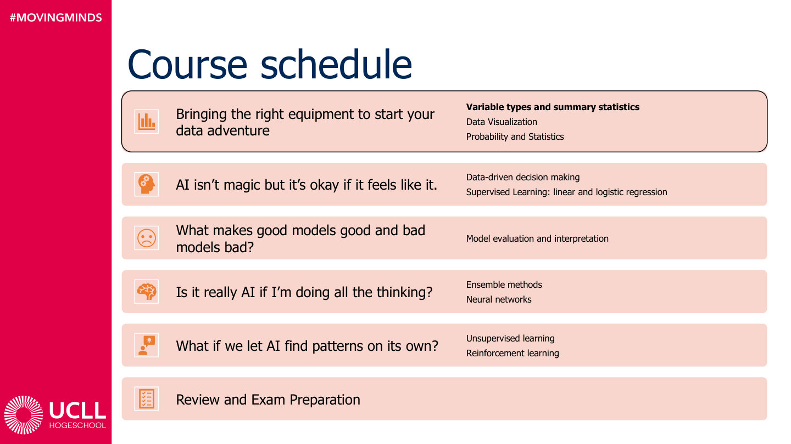

The schedule starts with equipment, variable types, summary statistics, visualization, and probability. Only after that does it move into supervised learning, model evaluation, ensembles, neural networks, unsupervised learning, and reinforcement learning.

### What this does

This ordering matters because machine learning depends on data understanding:

- **Variable types** tell the model how data should be represented.
- **Summary statistics** describe the center, spread, and unusual values.
- **Visualization** helps reveal patterns that numbers alone may hide.
- **Probability and statistics** provide the language for uncertainty.

### Why it needs to happen before modeling

A model does not know whether a number is a price, a rating, an ID, or a category encoded as a number. Humans must define those meanings first. EDA is the process of turning raw columns into understood information.

---

## 3. The case study: Ada Lovelace's travel agency


The course uses a fictional travel agency. This gives us a concrete setting for data questions about sales, customers, packages, costs, margins, and ratings.

### Why use a business case?

A business case makes the data meaningful. For example, "cost" is not just a number. It affects profit. "membership" is not just text. It may describe customer loyalty. "rating" is not just a score. It can represent customer satisfaction.

---

## 4. The data columns and what they represent

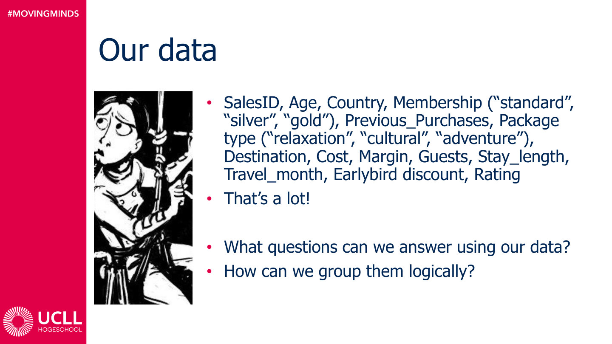

The dataset contains columns such as:

- `SalesID`
- `Age`
- `Country`
- `Membership`
- `Previous_Purchases`
- `Package type`
- `Destination`
- `Cost`
- `Margin`
- `Guests`
- `Stay_length`
- `Travel_month`
- `Earlybird discount`
- `Rating`

### What these columns do

Each column describes one aspect of a sale or customer:

- **Identifiers** such as `SalesID` distinguish one record from another.
- **Customer attributes** such as `Age`, `Country`, and `Membership` describe who bought the package.
- **Behavior attributes** such as `Previous_Purchases` show past customer activity.
- **Product attributes** such as `Package type` and `Destination` describe what was sold.
- **Financial attributes** such as `Cost` and `Margin` connect the sale to business performance.
- **Trip attributes** such as `Guests`, `Stay_length`, and `Travel_month` describe the travel plan.
- **Promotion attributes** such as `Earlybird discount` explain pricing conditions.
- **Feedback attributes** such as `Rating` describe customer satisfaction.

### Why grouping columns matters

Grouping columns logically helps us ask better questions. For example:

- To study profitability, focus on `Cost`, `Margin`, `Package type`, and `Destination`.
- To study customer loyalty, focus on `Membership`, `Previous_Purchases`, and `Rating`.
- To study seasonality, focus on `Travel_month`, `Destination`, and `Package type`.

Without grouping, the dataset looks like "a lot of columns." With grouping, it becomes a collection of business concepts.

---

## 5. Turning data into questions

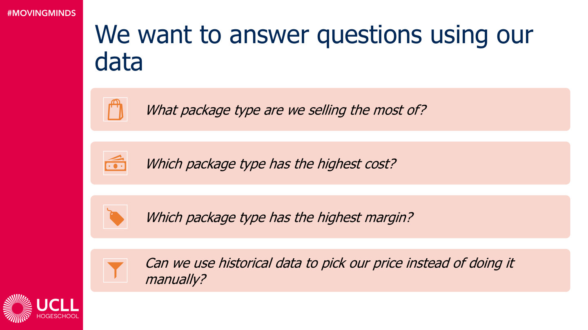

The lecture asks:

- What package type are we selling the most?
- Which package type has the highest cost?
- Which package type has the highest margin?
- Can historical data help us pick prices instead of doing it manually?

### What each question does

- **"Selling the most"** counts frequency. It tells us demand.
- **"Highest cost"** compares expenses. It tells us where money is spent.
- **"Highest margin"** compares profit potential. It tells us which products may be financially strongest.
- **"Use historical data to pick price"** moves from description toward prediction or optimization.

### Why questions come before calculations

EDA should not start by calculating random statistics. It should start with a question. The question decides:

- which columns matter,
- which data type each column has,
- which statistic is useful,
- which visualization makes sense,
- and what decision the analysis should support.

---

## 6. Data types

Data type is one of the most important ideas in the lecture. It tells us what operations are meaningful.

---

### 6.1 Continuous numeric data

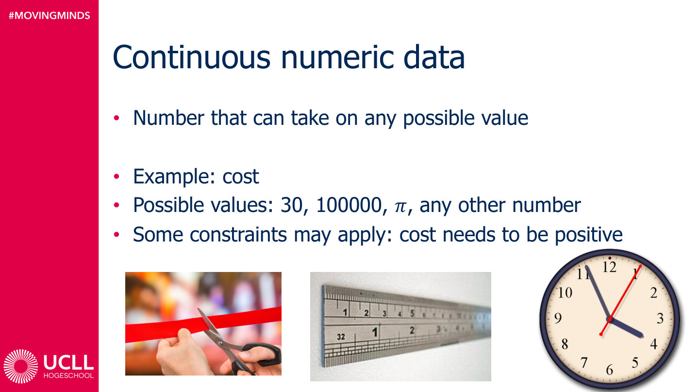

Continuous numeric data can take many possible values, including decimals and theoretically any value inside a valid range. The slide uses **cost** as the example.

### What it does

Continuous data represents measurements:

- cost,
- price,
- margin,
- height,
- distance,
- time,
- temperature.

Because these values are numeric measurements, we can usually calculate:

- mean,
- median,
- minimum and maximum,
- standard deviation,
- percentiles,
- differences,
- ratios.

### Why constraints matter

The slide notes that cost must be positive. This is a domain rule. A model or analysis may accept a negative cost mathematically, but the business meaning would be wrong.

So continuous variables need two kinds of understanding:

1. **Mathematical understanding:** it is a number that can be measured.
2. **Domain understanding:** only certain values make sense.

---

### 6.2 Discrete numeric data

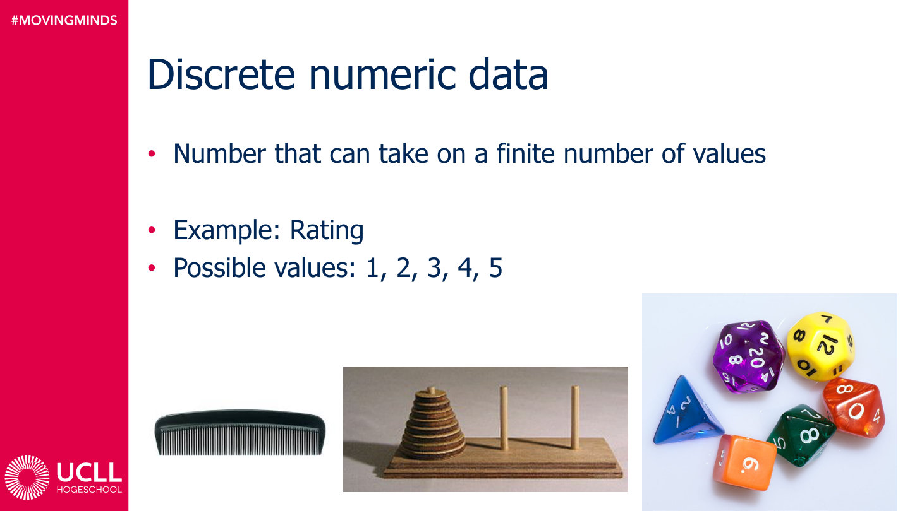

Discrete numeric data can only take a limited set of values. The slide uses **rating** with possible values 1, 2, 3, 4, and 5.

### What it does

Discrete numeric data often represents counts or fixed scores:

- number of guests,
- previous purchases,
- rating from 1 to 5,
- number of nights,
- number of tickets.

### Why it is different from continuous data

A rating of 4.5 may not exist if the system only allows whole numbers. A guest count of 2.7 is impossible. Because of this, we must avoid treating all numeric-looking columns as fully continuous measurements.

### Why this matters for analysis

Discrete variables can often be summarized by frequencies:

- How many customers gave rating 5?
- How many trips had 2 guests?
- How many customers made 0 previous purchases?

The mean can still be useful sometimes, but it may create values that do not actually exist in the dataset.

---

### 6.3 Nominal categorical data

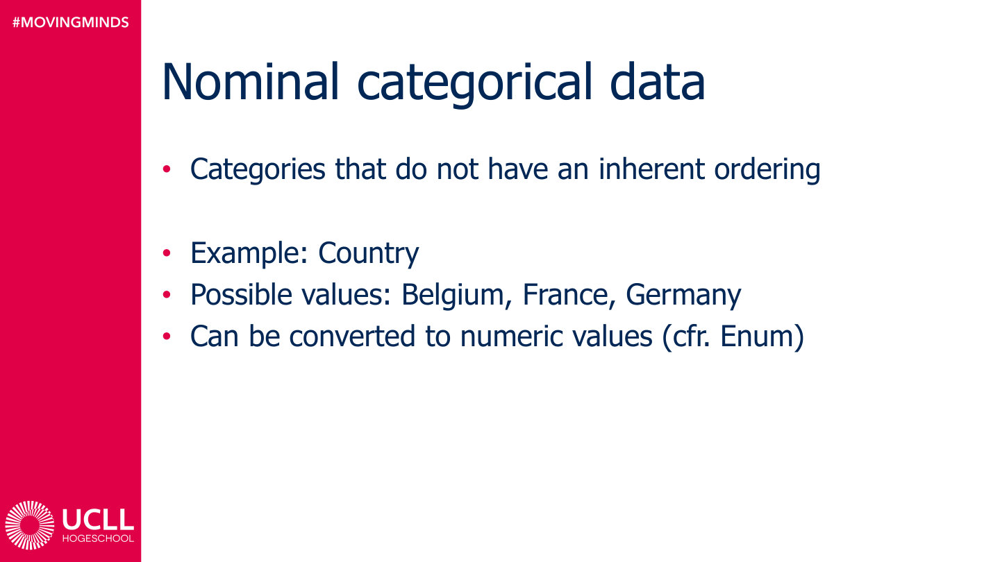

Nominal categorical data contains labels with no natural order. The slide uses **country** as the example.

### What it does

Nominal categories name groups:

- Belgium,
- France,
- Germany,
- destination,
- package type,
- payment method.

### What the labels do not do

They do not rank the values. Belgium is not "less than" France. France is not "greater than" Germany. The categories are different, but not ordered.

### Why encoding must be handled carefully

The slide says nominal categories can be converted to numeric values like an enum. That means we might store:

- Belgium = 1,
- France = 2,
- Germany = 3.

But those numbers are only codes. They do not mean Germany is three times Belgium or that France is the average of Belgium and Germany. This matters a lot in machine learning, because some models may incorrectly interpret numeric codes as ordered values.

---

### 6.4 Binary data

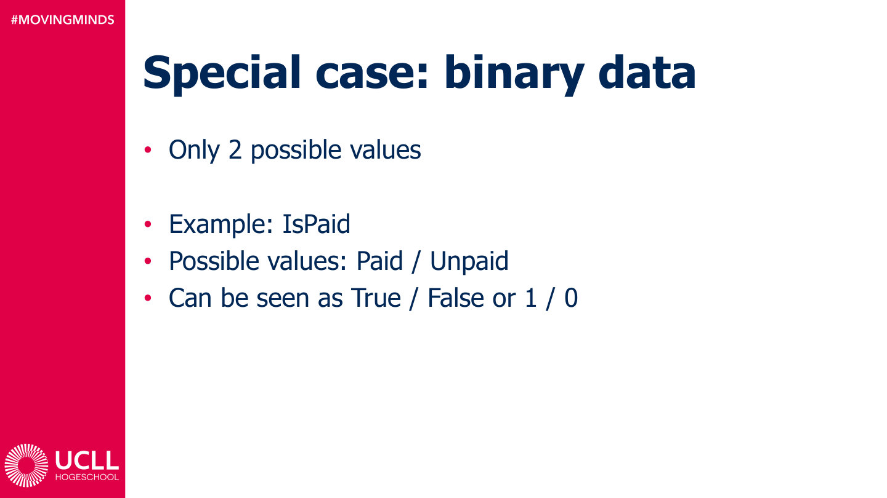

Binary data has only two possible values. The slide uses **paid/unpaid** as the example.

### What it does

Binary data represents yes/no states:

- paid or unpaid,
- earlybird discount or no discount,
- customer is a member or not,
- trip is domestic or international,
- booking was cancelled or not cancelled.

### Why binary data is useful

Binary variables are simple and powerful. They can be represented as:

- true/false,
- yes/no,
- 1/0.

This makes them easy to count, filter, and use in models.

### Why the meaning still matters

Even if binary data is stored as 1 and 0, the meaning must be clear. A 1 could mean paid, cancelled, member, or discount used. The number only becomes useful when the analyst knows what the flag represents.

---

### 6.5 Ordinal categorical data

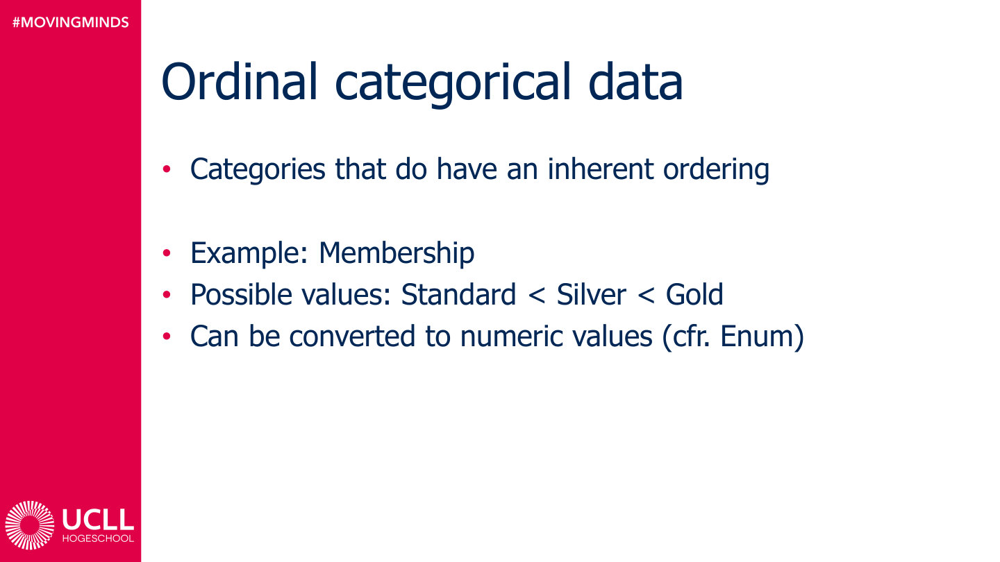

Ordinal categorical data has categories with a natural order. The slide uses **membership**:

`Standard < Silver < Gold`

### What it does

Ordinal data ranks categories:

- standard, silver, gold,
- low, medium, high,
- beginner, intermediate, advanced,
- poor, fair, good, excellent.

### Why ordinal data is not the same as continuous data

The order is meaningful, but the distance between categories may not be equal. The difference between standard and silver may not be the same as the difference between silver and gold.

### Why this matters

Ordinal data often needs special handling:

- It can be sorted.
- It can be compared by rank.
- It can sometimes be encoded as numbers.
- But the numeric encoding should not automatically be treated as a precise measurement.

---

## 7. Core summary statistics

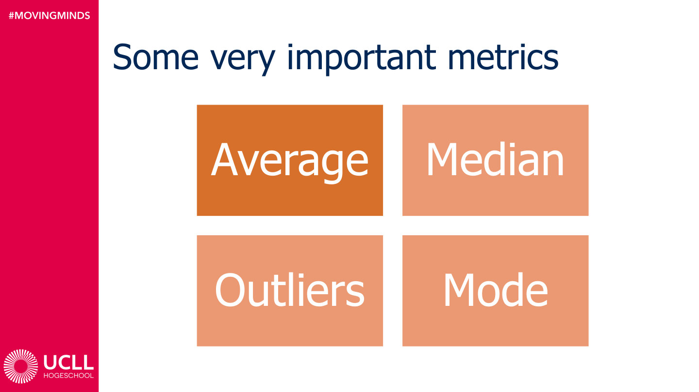

The lecture highlights four important ideas:

- average,
- median,
- outliers,
- mode.

These are summary tools. They reduce many data points into a smaller description.

### Why summary statistics are needed

Datasets can be too large to inspect row by row. Summary statistics help answer:

- Where is the center?
- What is typical?
- Are there strange values?
- Which value appears most often?
- Is the data balanced or skewed?

Each statistic does a different job, so choosing the right one matters.

---

## 8. The average and the "less than 2 legs" example

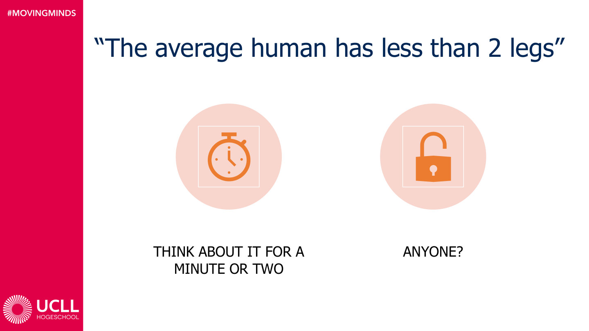

The statement "the average human has less than 2 legs" sounds absurd at first. Most people have 2 legs. But average does not mean "most common."

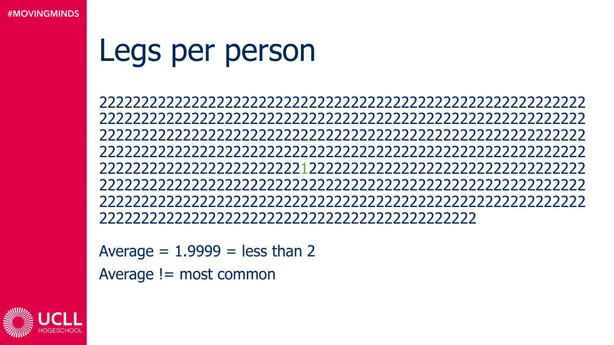

The visual shows many values of `2` and at least one value lower than `2`. When all values are added and divided by the number of people, the result becomes slightly less than 2.

### What the average does

The average, also called the mean, adds all values and divides by the number of values:

```text
mean = sum of all values / number of values
```

### Why the average can be useful

The mean is useful because it gives one number that represents the balance point of the data. In business, we might calculate:

- average cost,
- average margin,
- average stay length,
- average rating,
- average number of guests.

This helps compare groups quickly.

### Why the average can mislead

The mean is sensitive to unusual values. In the legs example, a small number of people with fewer than 2 legs makes the average less than 2. That result is mathematically correct, but it does not describe what is most common.

### What this teaches

The average answers: **What is the arithmetic balance point?**  
It does not necessarily answer: **What value should I expect to see most often?**

---

## 9. The mean as a formal metric

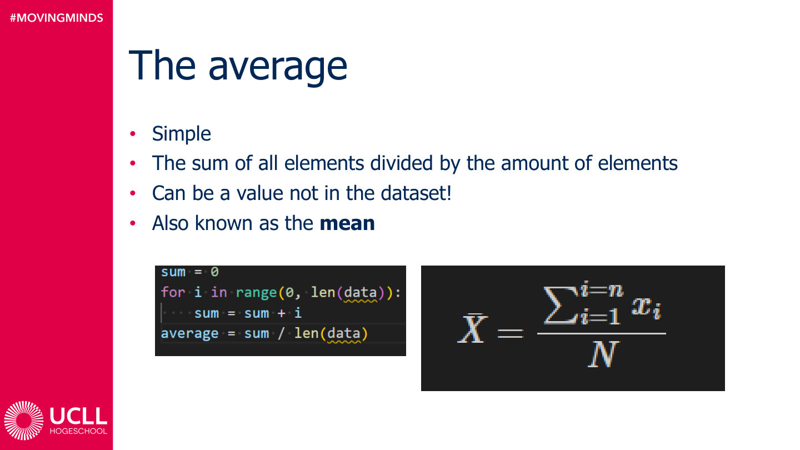

The slide defines the average as:

- simple,
- the sum of all elements divided by the amount of elements,
- a value that can be absent from the dataset,
- also known as the mean.

### What each point means

- **Simple:** The calculation is easy and widely understood.
- **Sum divided by count:** Every value contributes to the result.
- **Can be a value not in the dataset:** The mean of ratings 1 and 2 is 1.5, even if no one gave rating 1.5.
- **Also known as mean:** "Average" in this lecture refers to the arithmetic mean.

### Why this matters

Because every value contributes, the mean is powerful when data is balanced, but fragile when data contains extreme values.

---

## 10. The median

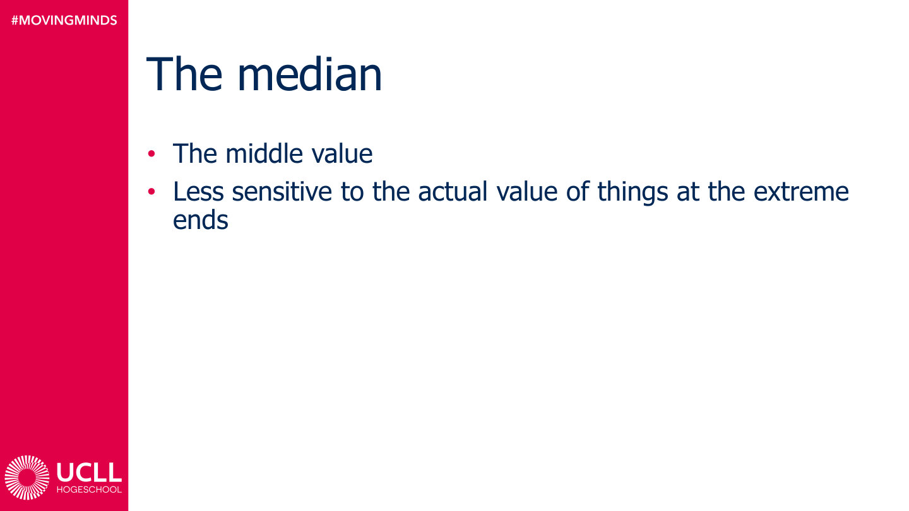

The median is the middle value after the data is sorted.

### What it does

The median splits the dataset into two halves:

- 50% of values are below or equal to it.
- 50% of values are above or equal to it.

### Why it is useful

The median is less sensitive to extreme values. If one trip costs far more than the others, the average cost can move a lot, but the median cost may stay close to what a typical customer pays.

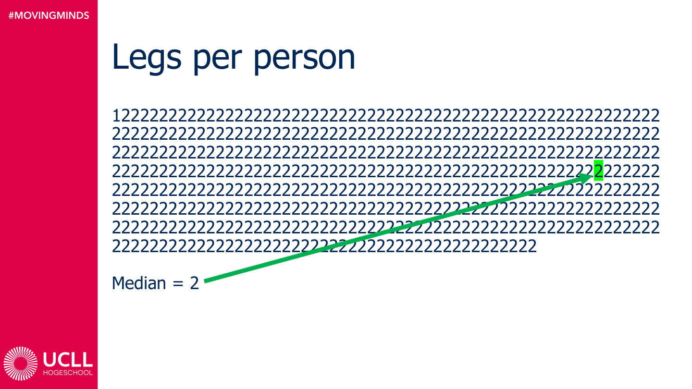

The legs example shows this clearly. Even if one person has fewer than 2 legs, the middle value is still 2 because almost all values are 2.

### Why the median can be better than the mean

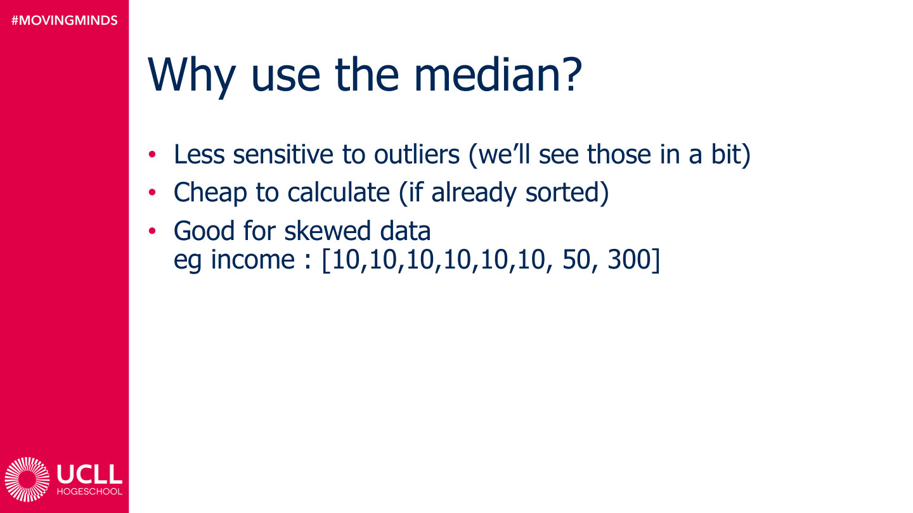

The slide gives an income-like example:

```text
[10, 10, 10, 10, 10, 10, 50, 300]
```

The value 300 pulls the mean upward. The median stays closer to the typical value.

### What this teaches

The median answers: **What is the middle observation?**  
It is especially useful when data is skewed or contains outliers.

---

## 11. Outliers

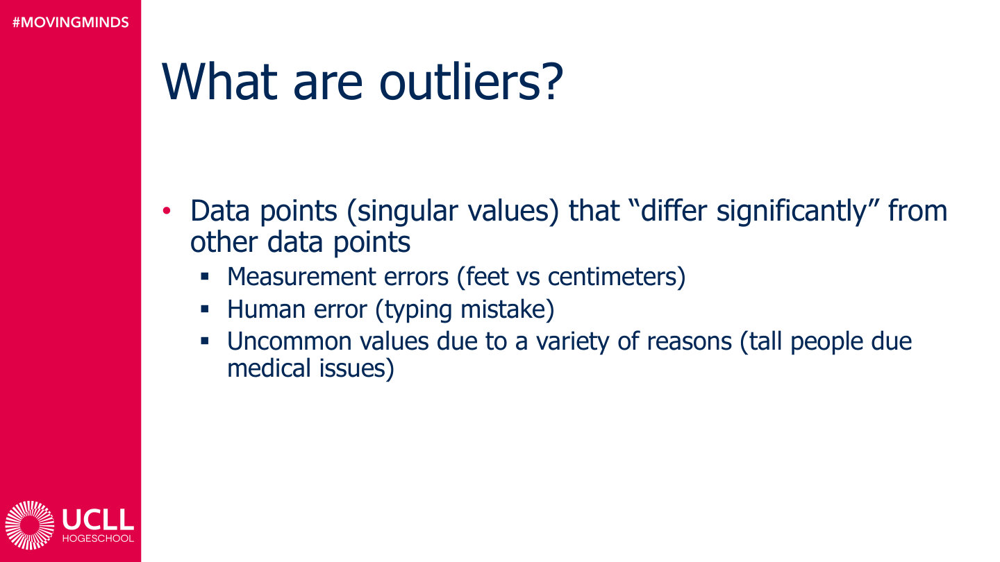

Outliers are values that differ significantly from the rest of the data.

### What outliers do

Outliers can:

- pull the mean upward or downward,
- stretch chart axes,
- make normal patterns harder to see,
- reveal errors,
- reveal rare but important events.

### Why outliers happen

The slide lists several causes:

- **Measurement errors:** For example, recording feet instead of centimeters.
- **Human error:** For example, typing an extra zero.
- **Uncommon real values:** For example, a genuinely unusual person, customer, or trip.

### Why outliers should not be deleted automatically

An outlier is not always wrong. A very expensive travel package might be a data entry mistake, but it might also be a luxury package that matters a lot for profit. The analyst must investigate.

### What this teaches

Outlier handling is not just technical. It is also a business decision:

- If the value is impossible, fix or remove it.
- If it is rare but real, keep it and understand its effect.
- If it changes the conclusion, report the analysis with and without it.

---

## 12. How statistics can mislead

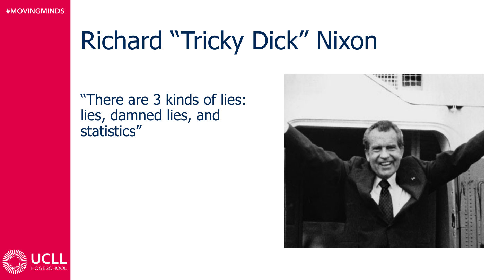

The quote says there are "lies, damned lies, and statistics." The point is not that statistics are bad. The point is that statistics can be used selectively.

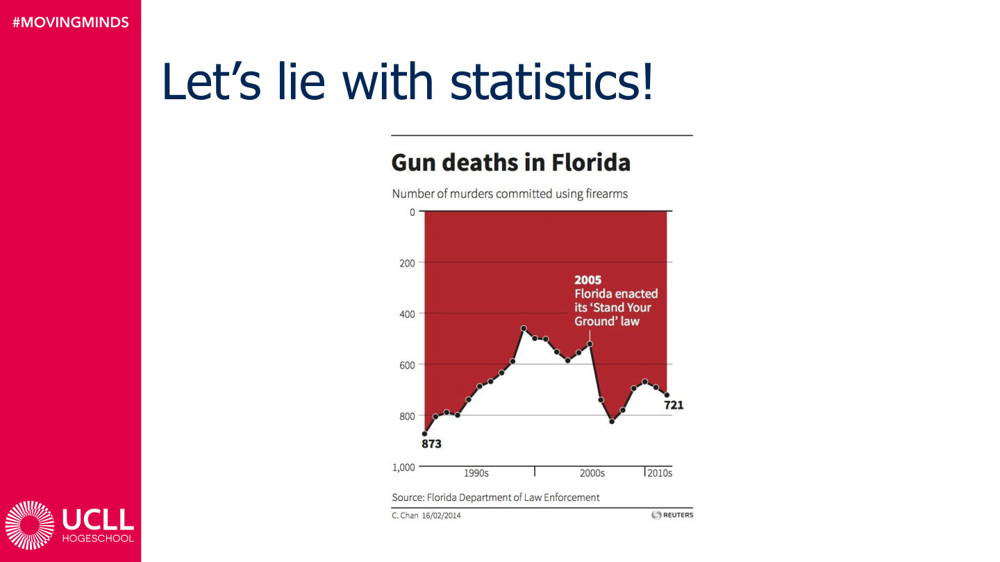

### What misleading statistics do

Misleading statistics usually do one of these:

- choose a metric that supports the desired story,
- hide outliers,
- ignore sample size,
- compare groups unfairly,
- use a chart scale that exaggerates differences,
- present correlation as causation,
- report an average when the median would be more honest.

### Why this matters in EDA

EDA is partly about protecting ourselves from bad conclusions. If we only calculate one number, we may tell an incomplete story. A good analysis checks multiple views of the same data.

For example, with travel package cost:

- Mean cost may show total financial weight.
- Median cost may show typical customer experience.
- Mode may show the most common price point.
- Outliers may reveal luxury or data errors.
- A box plot may show spread and unusual values.

---

## 13. Mode

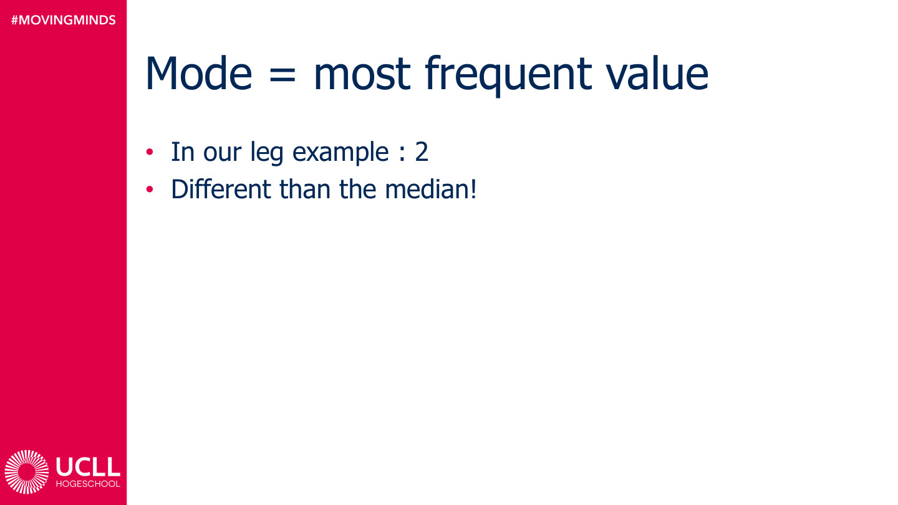

The mode is the most frequent value.

### What it does

The mode answers: **Which value appears most often?**

In the legs example, the mode is 2 because 2 is the most common number of legs.

### Why it is different from mean and median

- The **mean** is the arithmetic balance point.
- The **median** is the middle value.
- The **mode** is the most common value.

These can be the same, but they do not have to be.

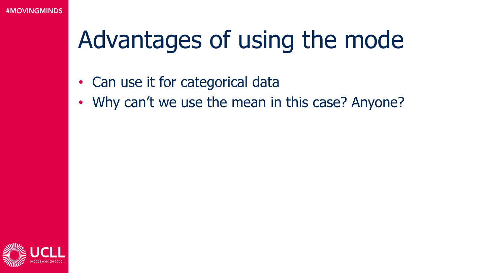

### Why the mode is important for categorical data

For categories, mean often makes no sense. We cannot average `Belgium`, `France`, and `Germany`. But we can count which country appears most often.

The mode works well for:

- most common country,
- most common destination,
- most common package type,
- most common membership level,
- most common rating.

### Why this is needed

Many business questions are frequency questions. For example:

- Which package type sells most often?
- Which destination is most popular?
- Which membership level is most common?

The mode is the summary statistic designed for that kind of question.

---

## 14. Q1, Q3, and quartiles

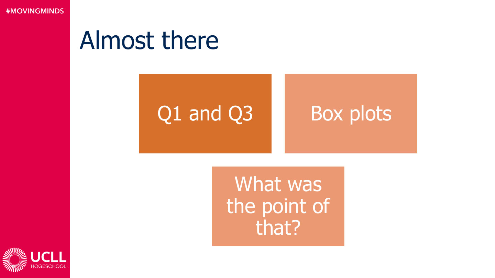

Q1 and Q3 are quartiles:

- **Q1** is the first quartile, around the 25% point.
- **Q3** is the third quartile, around the 75% point.

### What they do

Quartiles divide sorted data into quarters:

- 25% of values are at or below Q1.
- 50% of values are around the median.
- 75% of values are at or below Q3.

### Why quartiles are needed

The median gives one center point, but it does not show spread. Q1 and Q3 show the middle range of the data. This is useful because two datasets can have the same median but very different variability.

### Interquartile range

The distance between Q1 and Q3 is called the interquartile range:

```text
IQR = Q3 - Q1
```

The IQR describes the spread of the middle 50% of the data.

---

## 15. Box plots

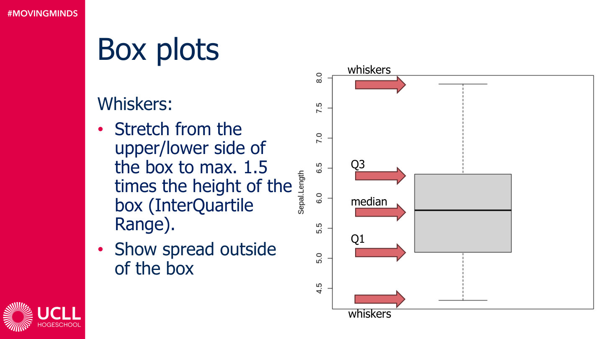

A box plot is a compact picture of distribution.

### What each part does

- **Median line:** Shows the middle of the data.
- **Q1:** Shows the lower edge of the middle 50%.
- **Q3:** Shows the upper edge of the middle 50%.
- **Box:** Runs from Q1 to Q3, so it shows the interquartile range.
- **Whiskers:** Extend from the box toward the lower and upper non-outlier values.
- **Outlier points, when shown:** Values outside the whisker range.

### Why the whiskers use 1.5 times the IQR

The slide says whiskers stretch to a maximum of 1.5 times the height of the box, meaning 1.5 times the IQR. This rule gives a practical boundary for "normal enough" spread. Values beyond that boundary are candidates for outliers.

### Why box plots are useful

Box plots show several ideas at once:

- center,
- spread,
- skew,
- unusual values,
- comparison between groups.

For the travel agency, box plots could compare:

- cost by package type,
- margin by destination,
- rating by membership level,
- stay length by travel month.

### Why this matters

A table of averages may hide variability. A box plot can show whether one package type has stable margins while another has very inconsistent margins.

---

## 16. The point of all these tools

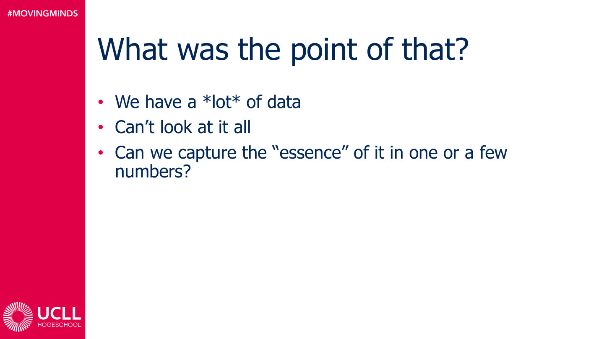

The final question is: **What was the point of that?**

The answer: we have a lot of data, and we cannot inspect all of it manually. We need a way to capture the "essence" of the data in one or a few numbers and visuals.

### What summary tools do together

| Tool | What it does | Why it is needed |
| --- | --- | --- |
| Mean | Calculates the arithmetic balance point | Useful for balanced numeric data and quick comparisons |
| Median | Finds the middle value | Better for skewed data or data with outliers |
| Mode | Finds the most common value | Works for categorical data and popularity questions |
| Outlier detection | Finds unusual values | Helps catch errors and rare important cases |
| Q1 and Q3 | Mark the lower and upper quartiles | Describe spread around the median |
| IQR | Measures the middle 50% spread | Helps compare variability and define outlier boundaries |
| Box plot | Visualizes median, quartiles, spread, and outliers | Gives a fast overview of distribution |

---

## 17. Practical EDA workflow for the travel agency

Using the lecture ideas, a good EDA workflow would be:

1. **Start with a question.**  
   Example: Which package type has the highest margin?

2. **Identify relevant columns.**  
   Example: `Package type`, `Margin`, `Cost`, `Destination`.

3. **Classify data types.**  
   `Package type` is nominal categorical. `Margin` and `Cost` are continuous numeric.

4. **Check basic quality.**  
   Look for missing values, impossible values, duplicates, and suspicious outliers.

5. **Calculate summary statistics.**  
   Use mean and median margin, count packages, and check mode for most common package type.

6. **Visualize distributions.**  
   Use box plots to compare margins across package types.

7. **Interpret with caution.**  
   Ask whether outliers, skew, or small sample sizes are changing the conclusion.

8. **Connect back to business decisions.**  
   Use the result to support pricing, marketing, or package design.

---

## 18. Key takeaways

- EDA is about understanding data before modeling it.
- A column's data type determines what calculations and charts make sense.
- The mean is useful, but it can be misleading with outliers or skewed data.
- The median better represents the middle of skewed data.
- The mode is especially useful for categorical data.
- Outliers can be errors, rare real events, or important business signals.
- Q1, Q3, IQR, and box plots help summarize spread and detect unusual values.
- Statistics are not automatically truthful. They need context, correct interpretation, and honest presentation.

---

## Appendix: all rendered slide pictures

The images below are included so the Markdown file uses the visual material from the PDF directly. The main explanations above focus on the slides that introduce or clarify the core concepts.

<details>
<summary>Open all slide screenshots</summary>


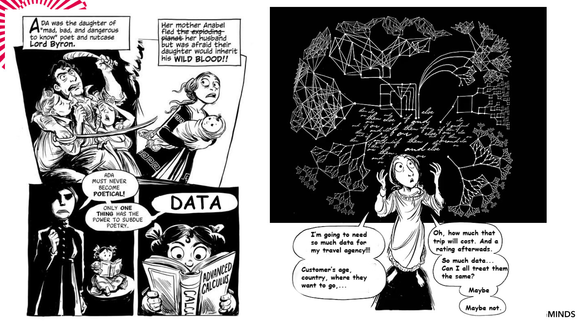


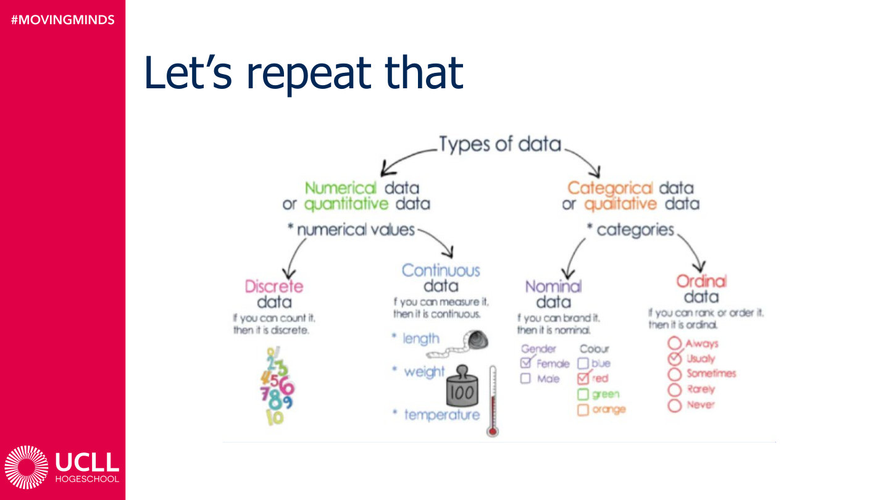


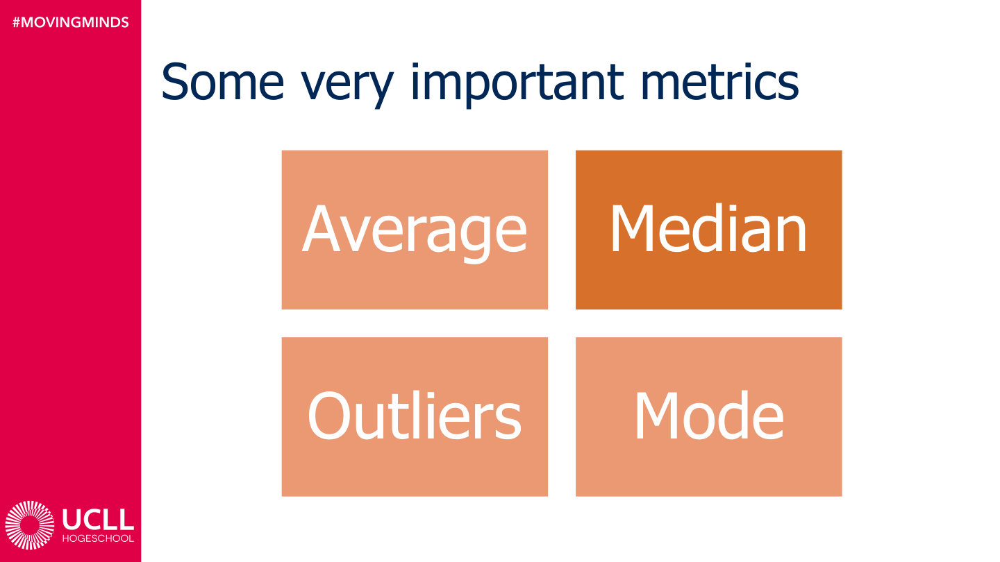


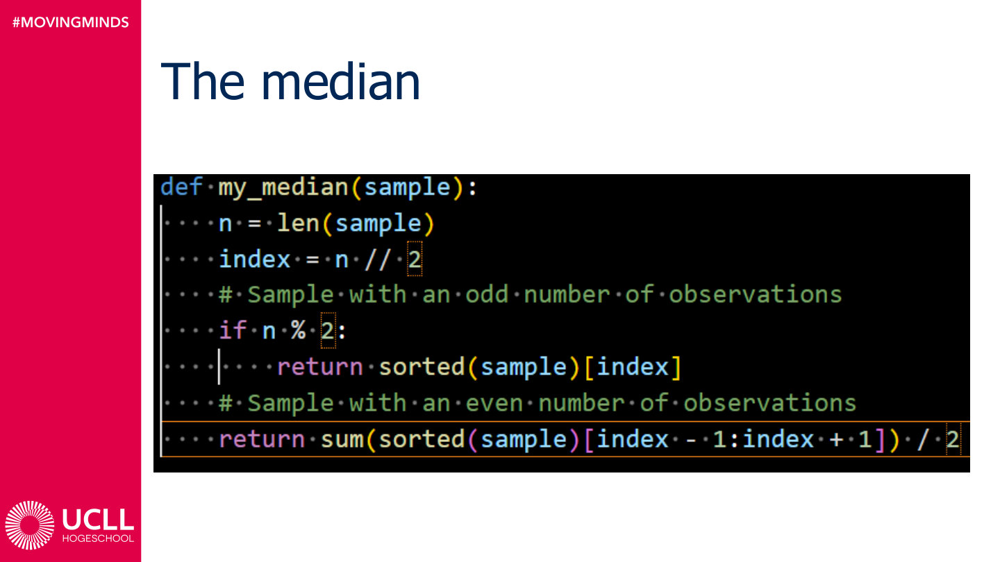

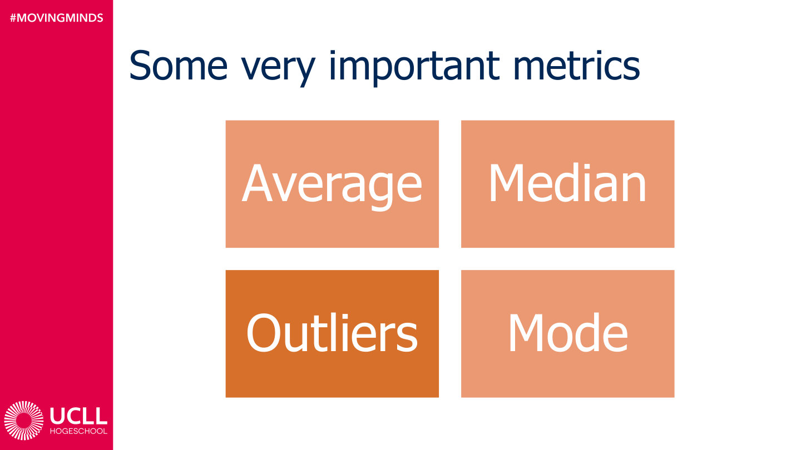


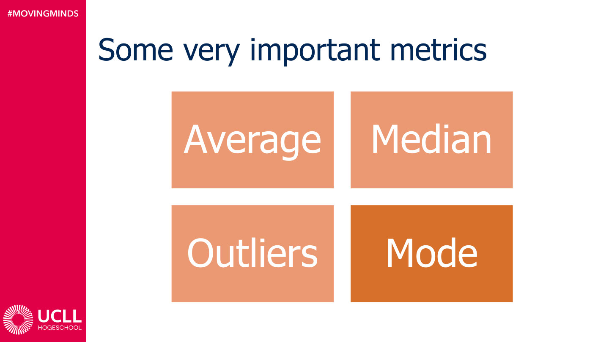


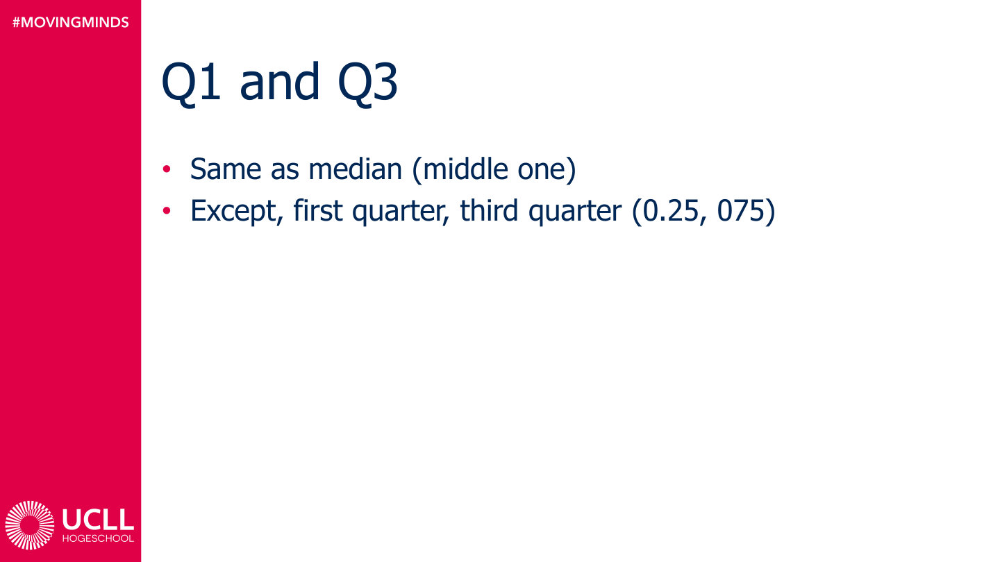
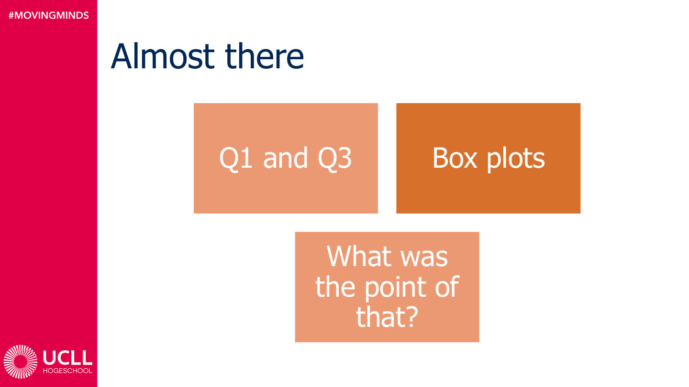
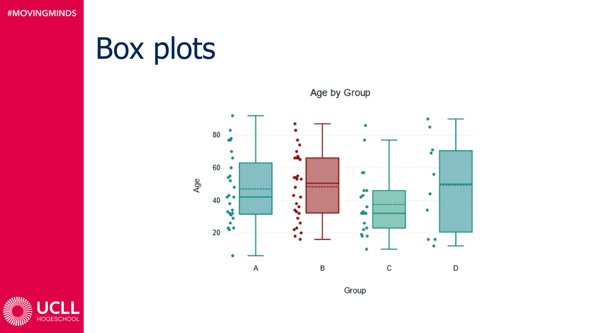

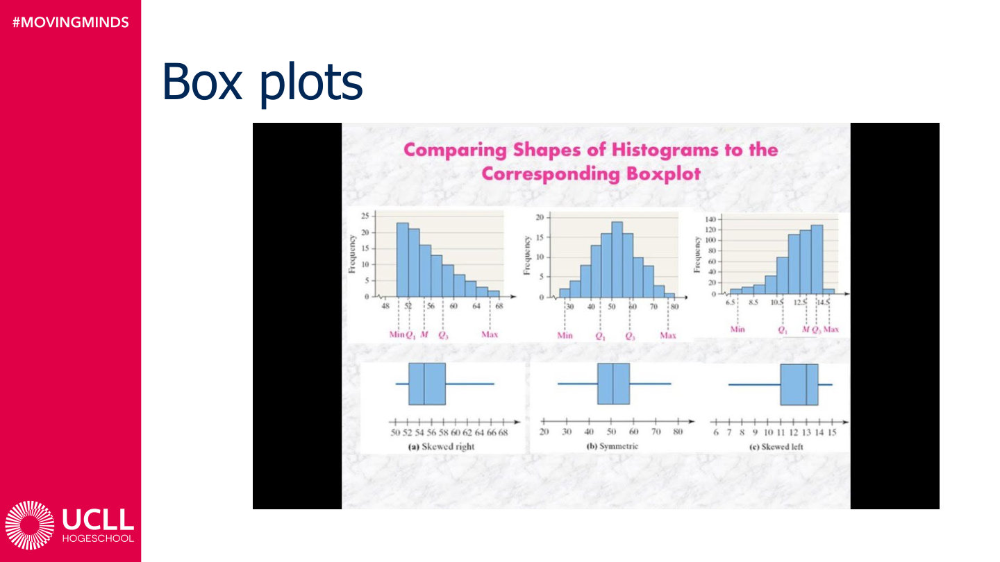
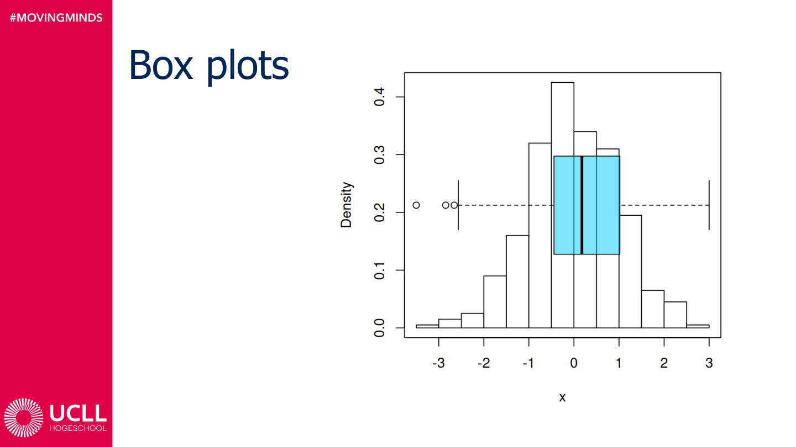
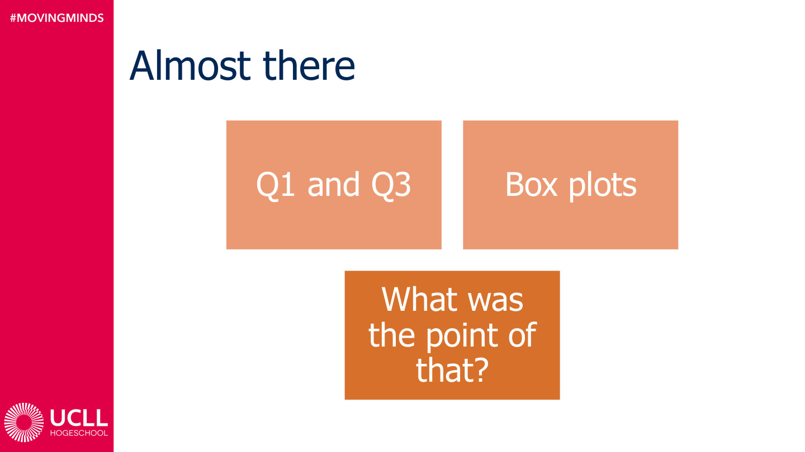


</details>
